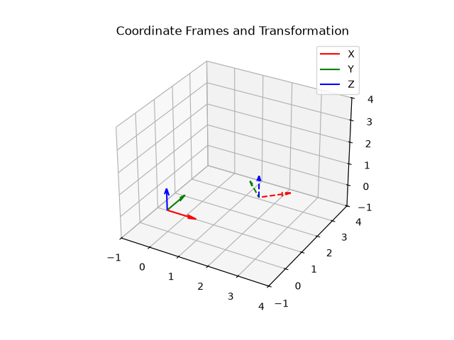

# coordinate frames n transformations

in 3d computer vision, we need to represent objects in 3d space accurately. we use coordinate frames to define where things r.

## mathematical representation
we use 4x4 matrices in $SE(3)$ to represent rotations and translations together. this is called homogeneous coordinates.
a point is represented as $(x, y, z, 1)$. this allows us to combine rotation and translation into a single matrix multiplication!

## what the script does
the python script creates simple rotation n translation matrices using numpy. it then applies these transformations to a 3d coordinate frame and plots the original (solid lines) n the transformed frame (dashed lines) using matplotlib.
this is super useful cos everything in 3d space relates to these transformations.
