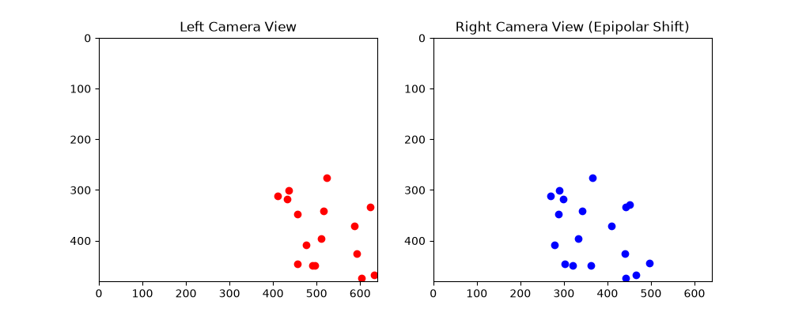

# epipolar geometry

this is the core of stereovision n 3d reconstruction. it tells us how to map a point in one camera view to a line in another view.

## the math
it uses fundamental and essential matrices. the fundamental matrix relates corresponding points in stereo images. we can calculate it using the 8-point algorithm with singular value decomposition (svd).
epipolar lines r the projection of the camera ray from one view into the other.

## the script
i wrote a script that simulates a stereo camera setup! it creates random 3d points and projects them into two different camera views (left n right). u can see how the points shift horizontally, just like how our two eyes perceive depth.
