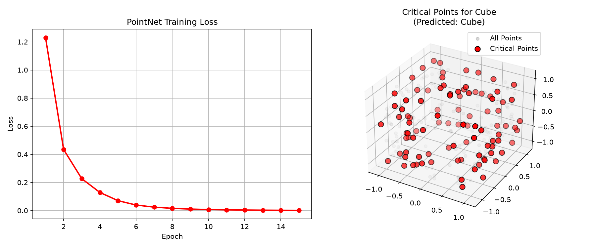

# pointnet

pointnet is literally the "hello world" of 3d deep learning. standard cnns fail on point clouds cos they r unordered. pointnet fixes this!

## details
to process an unordered set of points, pointnet processes each point independently with a shared multi-layer perceptron (mlp), mapping them to a high-dimensional space. then it uses a symmetric mathematical function - specifically max pooling - to aggregate features across all points into a single global feature vector that represents the whole shape.

## the script
we generate a synthetic dataset of 3d shapes (spheres, cubes, n cylinders), train a mini pointnet model to classify them, n plot the training loss alongside the "critical points" that the model picked out to identify a cube. u can see the red points are the most important corners/edges that define the shape!
