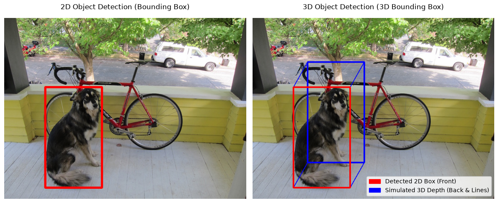

# 2d vs 3d object detection

in traditional computer vision, we detect objects in 2d using flat bounding boxes. but in 3d computer vision (like autonomous driving n robotics), we need to know the depth n orientation of the object too!

## color coding details
to make it super nderstandable what is actually detected vs what is simulated depth:
- **red square:** this is the original 2d detection box (the front face). it shows exactly where the object was found in the flat image.
- **blue lines n square:** this is the generated 3d depth n the back face of the box. it represents the simulated 3d volume projecting out from the 2d detection.

## 2d detection (opencv)
the script downloads an image of a pet dog from the web n uses standard object detection to draw a simple 2d rectangle `(x, y, w, h)` around it.

## 3d detection (simulated)
a true 3d detection model outputs a 3d bounding box `(x, y, z, l, w, h, yaw)`. since we dont have real lidar data here, the script simulates this by projecting a 3d box onto the 2d image using geometric offsets.

## comparison
the script outputs a single combined image `output_comparison.png` which shows three different approaches:
- **2d opencv box:** standard flat bounding box
- **pseudo-3d projection (vanishing trick):** a lightweight 2d geometric illusion
- **true 3d projection (cv2.projectPoints):** a mathematically accurate 3d camera projection model

this 3-way comparison makes it really easy to understand how true 3d projection gives us much more spatial awareness and accuracy!
