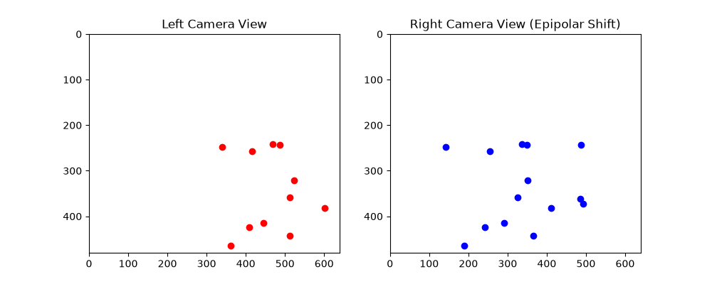
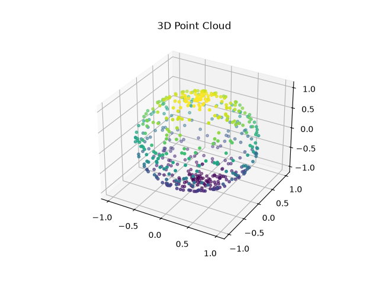
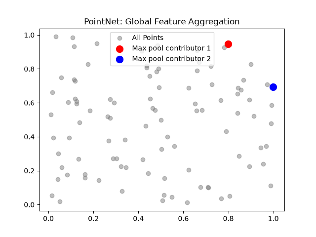

# 3dcv

this repo tracks my journey n projects as i learn n build stuff in 3d computer vision (3dcv).

## my learning approach

### 1. master the mathematical foundation (multi-view geometry)

before even touching a neural net, u gotta understand how the 3d world projects onto a 2d sensor. this is literally just linear algebra n matrix operations.
- **coordinate frames n transformations:** representing 3d rotations n translations using matrices in $SE(3)$.
- **camera models:** understand the pinhole camera model. manual setup of the intrinsic matrix (focal length n optical center) n extrinsic matrix.
- **epipolar geometry:** the core of stereovision! mapping a point in one camera view to a line in another.
- **project idea:** implement a fundamental matrix calculator entirely from scratch using numpy. no opencv for this step - gotta code the svd n matrix multiplications manually!

### 2. understand 3d data representations

unlike 2d images which r always just grids, 3d data requires picking a representation first:
- **point clouds:** unordered sets of (x, y, z) coordinates. usually raw sensor data from lidar.
- **voxels:** 3d pixel grids. super easy cos 3d convolutions work on them, but incredibly memory-intensive.
- **meshes:** vertices n faces defining a surface. great for graphics, mathematically harder for neural nets.
- **implicit representations:** functions (like nerfs) mapping a continuous 3d coordinate straight to density or color.

### 3. the "hello world" of 3d deep learning

once the math n data structures make sense, building the first 3d network is next. pointnet is the perfect starting point.
- standard cnns fail on point clouds cos point clouds r orderless.
- pointnet solves this by using a symmetric math function - specifically max pooling - to aggregate features across all points.
- **project idea:** build pointnet from scratch in pytorch using shared mlps n train it on modelnet40.

### 4. real-time tooling n hardware processing
since 3d point clouds can have millions of points, real-time performance needs more than just python.
- **open3d:** modern library that bridges the gap. great python bindings for prototyping, but core is optimized c++.

### 5. 2d vs 3d object detection

a final showcase comparing traditional 2d cv with 3d cv!
- **2d detection:** using opencv to detect objects with a standard flat 2d bounding box.
- **3d detection:** projecting a 3d bounding box to estimate depth n spatial volume (super critical for robotics n self driving cars).
