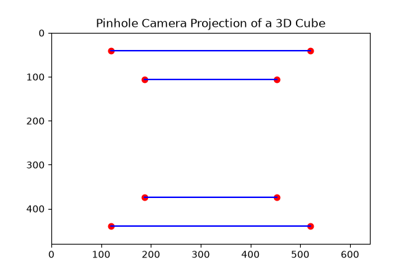
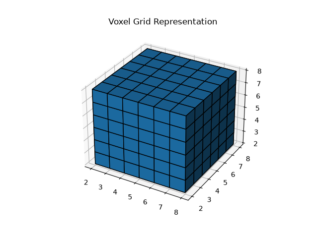
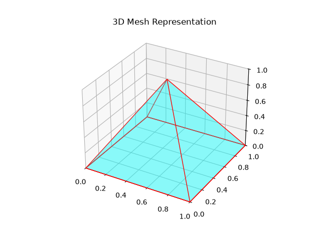
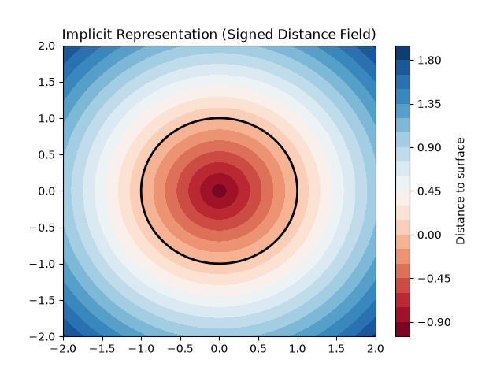
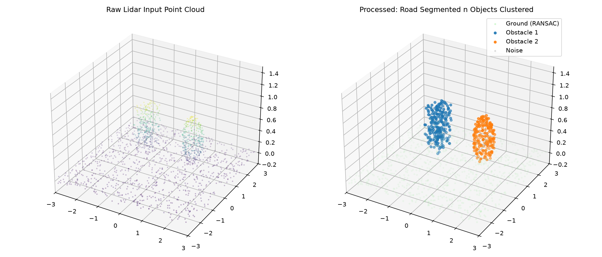
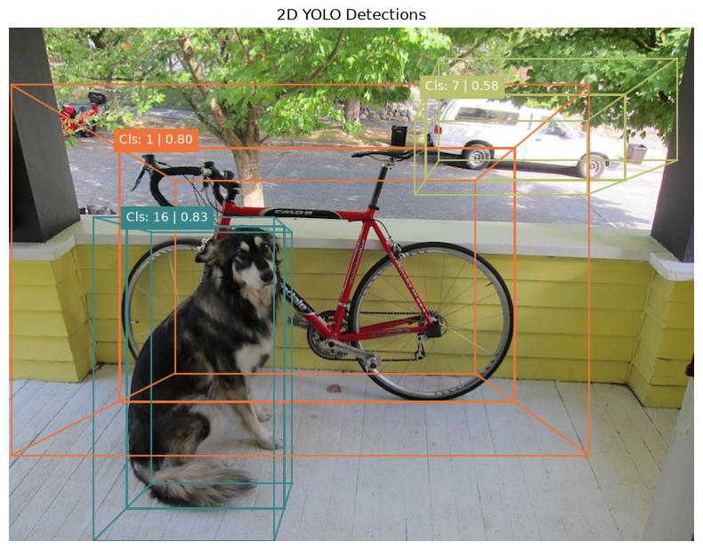
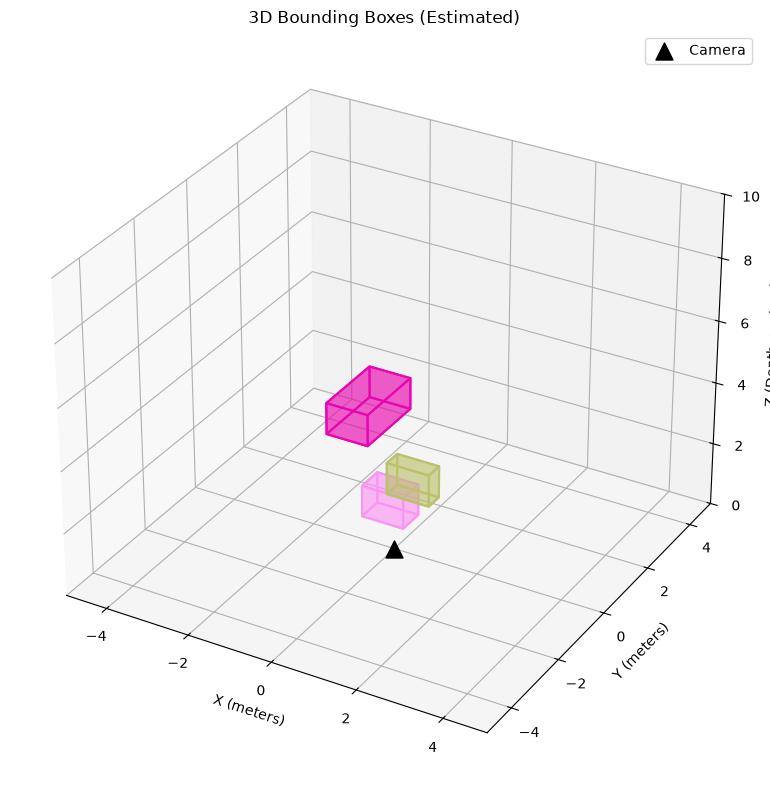

# 3dcv

this repo tracks my journey n projects as i learn n build stuff in 3d computer vision (3dcv).

---

## directory map

```
3DCV/
├── 1_Mathematical_Foundation/
│   ├── 1_1_Coordinate_Frames/    # SE(3) rotation + translation matrices
│   ├── 1_2_Camera_Models/        # pinhole camera projection
│   └── 1_3_Epipolar_Geometry/    # stereo vision fundamentals
├── 2_3D_Data_Representations/
│   ├── 2_1_Point_Clouds/         # unordered (x,y,z) sets
│   ├── 2_2_Voxels/               # 3d pixel grids
│   ├── 2_3_Meshes/               # vertices + faces
│   └── 2_4_Implicit_Representations/  # signed distance fields
├── 3_3D_Deep_Learning/
│   └── 3_1_PointNet/             # shape classification on point clouds
├── 4_Real_Time_Tooling/
│   └── 4_1_Open3D_Processing/    # lidar pipeline (downsample → segment → cluster)
├── 5_Object_Detection_2D_vs_3D/  # opencv 2d vs 3d bounding box comparison
├── generate_all.py               # regenerates every script, readme, n output image
└── README.md
```

each topic folder contains:
| file | purpose |
|---|---|
| `script.py` | standalone python script that generates the output |
| `README.md` | explanation of the math n concepts for that topic |
| `output.png` | visualization produced by `script.py` |

---

## my learning approach

### 1. master the mathematical foundation (multi-view geometry)

before even touching a neural net, u gotta understand how the 3d world projects onto a 2d sensor. this is literally just linear algebra n matrix operations.

#### 1_1 · coordinate frames n transformations

> representing 3d rotations n translations using 4×4 matrices in $SE(3)$.


a point is represented in homogeneous coordinates as $(x, y, z, 1)$. this lets us combine rotation and translation into a single matrix multiplication. the script builds a rotation matrix (around the z-axis) and a translation matrix using numpy, multiplies them together, and plots the original frame (solid arrows) vs the transformed frame (dashed arrows).

<details>
<summary>files in <code>1_1_Coordinate_Frames/</code></summary>

| file | description |
|---|---|
| `script.py` | creates $SE(3)$ rotation + translation matrices, applies them to a coordinate frame, n plots original vs transformed axes in 3d |
| `README.md` | explains homogeneous coordinates n why 4×4 matrices matter |
| `output.png` | 3d plot showing solid (original) n dashed (transformed) coordinate axes |

</details>

#### 1_2 · camera models (pinhole projection)

> understand how a 3d point in the world projects onto a 2d sensor using the intrinsic matrix $K$.



the pinhole camera model uses an intrinsic matrix with focal length $(f_x, f_y)$ and optical center $(c_x, c_y)$. the extrinsic matrix handles where the camera is in the world, while the intrinsic matrix handles how the camera projects the light. the script projects a 3d cube onto a 2d plane — u can see the perspective effect where objects further away look smaller.

<details>
<summary>files in <code>1_2_Camera_Models/</code></summary>

| file | description |
|---|---|
| `script.py` | sets up intrinsic matrix $K$, defines 8 corners of a 3d cube, projects them to 2d pixel coords |
| `README.md` | explains pinhole model, intrinsic vs extrinsic matrices |
| `output.png` | 2d plot of the projected cube showing perspective distortion |

</details>

#### 1_3 · epipolar geometry

> the core of stereovision — mapping a point in one camera view to a line in another.


uses fundamental and essential matrices. the fundamental matrix relates corresponding points in stereo images. we can calculate it using the 8-point algorithm with singular value decomposition (svd). the script simulates a stereo camera setup with random 3d points projected into two views — u can see the horizontal shift, just like how our two eyes perceive depth.

<details>
<summary>files in <code>1_3_Epipolar_Geometry/</code></summary>

| file | description |
|---|---|
| `script.py` | simulates two cameras with a 5-unit baseline, projects 20 random 3d points into both views |
| `README.md` | explains fundamental matrix, epipolar lines, n the 8-point algorithm |
| `output.png` | side-by-side left n right camera views showing the horizontal point shift |

</details>

- **project idea:** implement a fundamental matrix calculator entirely from scratch using numpy. no opencv for this step - gotta code the svd n matrix multiplications manually!

---

### 2. understand 3d data representations

unlike 2d images which r always just grids, 3d data requires picking a representation first.

#### 2_1 · point clouds

> unordered sets of $(x, y, z)$ coordinates — usually raw sensor data from lidar.


a point cloud is simply an $N \times 3$ matrix. since its unordered, changing the row order doesnt change the 3d shape at all. they are memory efficient for sparse structures but lack connectivity info. the script generates a random sphere using spherical coordinates n colors it by z-height.

<details>
<summary>files in <code>2_1_Point_Clouds/</code></summary>

| file | description |
|---|---|
| `script.py` | samples 500 random points on a unit sphere using $(\theta, \phi)$ spherical coords |
| `README.md` | explains point cloud structure, $N \times 3$ format, n ordering invariance |
| `output.png` | 3d scatter plot of the sphere colored by z-axis (viridis colormap) |

</details>

#### 2_2 · voxels

> 3d pixel grids — easy cos 3d convolutions work on them, but incredibly memory-intensive ($O(N^3)$).



each voxel cell is either empty or filled (or has a density value). conceptually simple cos u can apply 3d convolutions directly like 2d images, but most of a 3d space is empty so it wastes a ton of memory. the script builds a hollow box by filling a 10×10×10 grid and carving out the center.

<details>
<summary>files in <code>2_2_Voxels/</code></summary>

| file | description |
|---|---|
| `script.py` | creates a `10×10×10` boolean numpy array, fills a cube shell, n renders it with matplotlib voxels |
| `README.md` | explains voxel grids, memory complexity, n why 3d convolutions work on them |
| `output.png` | 3d rendering of the hollow voxel box |

</details>

#### 2_3 · meshes

> vertices n faces defining a surface — standard for computer graphics, harder for neural nets.



a mesh stores a list of 3d vertices n a list of faces (usually triangles) that connect them. this explicitly defines the surface topology. great for rendering, but harder for neural nets to process directly cos of irregular graph structures. the script builds a simple pyramid from 5 vertices and 5 faces.

<details>
<summary>files in <code>2_3_Meshes/</code></summary>

| file | description |
|---|---|
| `script.py` | defines 5 vertices n 5 faces of a pyramid, renders it as a `Poly3DCollection` |
| `README.md` | explains mesh topology, vertices vs faces, n graph irregularity challenges |
| `output.png` | 3d rendering of the semi-transparent cyan pyramid with red edges |

</details>

#### 2_4 · implicit representations

> continuous functions mapping 3d coordinates to density or color (like nerfs).



nerfs (neural radiance fields) use this — a neural network takes an $(x, y, z)$ coordinate and outputs color and density. this allows infinite resolution since its a continuous function. the script shows a 2d slice of a signed distance field (sdf) for a sphere: the black contour is the surface (distance=0), inside is negative, outside is positive.

<details>
<summary>files in <code>2_4_Implicit_Representations/</code></summary>

| file | description |
|---|---|
| `script.py` | computes a 2d signed distance field $f(x,y) = \sqrt{x^2+y^2} - 1$ on a 100×100 grid |
| `README.md` | explains implicit functions, signed distance fields, n nerfs |
| `output.png` | contour plot with the zero-level surface highlighted in black |

</details>

---

### 3. the "hello world" of 3d deep learning

once the math n data structures make sense, building the first 3d network is next. pointnet is the perfect starting point.

#### 3_1 · pointnet

> standard cnns fail on point clouds cos points r unordered — pointnet fixes this with shared mlps + symmetric max pooling.


pointnet processes each point independently with a shared multi-layer perceptron (mlp), mapping them to a high-dimensional space. then it uses a symmetric function — max pooling — to aggregate all point features into a single global feature vector. the model learns to identify shapes by looking at specific "critical points" — in the plot, the red points outline the corners n edges of the cube that the max pooling step picked out.

<details>
<summary>files in <code>3_1_PointNet/</code></summary>

| file | description |
|---|---|
| `script.py` | generates synthetic spheres/cubes/cylinders (256 pts each), trains a mini PointNet classifier (Conv1d → BN → MaxPool → FC), n visualizes training loss + critical points |
| `README.md` | explains the permutation invariance problem, shared mlps, symmetric functions, n critical points |
| `output.png` | **left:** training loss curve over 15 epochs · **right:** 3d plot of a cube with gray (all) n red (critical) points |

</details>

**what i built:** coded a mini pointnet from scratch in pytorch! generated a synthetic dataset of 3d shapes (spheres, cubes, n cylinders) n trained it to classify them.

---

### 4. real-time tooling n hardware processing

since 3d point clouds can have millions of points, real-time performance needs more than just python. we use open3d (which wraps optimized c++ under the hood) to handle massive geometry operations fast.

#### 4_1 · open3d lidar processing pipeline

> downsample → ransac plane segmentation → dbscan clustering



the pipeline:
1. **voxel downsampling** — average points in tiny 3d grids to drastically cut down point count while keeping shapes intact.
2. **ransac plane segmentation** — mathematically fit a flat plane to the road. once we identify the road, we filter it out to isolate actual obstacles.
3. **dbscan clustering** — group the remaining points based on density. if points r close together, they belong to the same object (car, pedestrian, etc.).

the script has a hardware fallback — if the cpu lacks avx/avx2 support, it runs the full pipeline with numpy + scikit-learn instead of open3d so it never crashes.

<details>
<summary>files in <code>4_1_Open3D_Processing/</code></summary>

| file | description |
|---|---|
| `script.py` | simulates a lidar scan (ground plane + sphere + box obstacles), runs the 3-stage pipeline (open3d or numpy/sklearn fallback), n plots raw vs processed point clouds |
| `README.md` | explains voxel downsampling, ransac, dbscan, n the avx hardware fallback |
| `output.png` | **left:** raw lidar input · **right:** segmented road (green) + clustered obstacles (colored) |

</details>

---

### 5. 2d vs 3d object detection

a massive upgrade from basic haar cascades to a fully modular, production-ready pipeline using a state-of-the-art **yolo26** model exported to onnx. super critical for robotics n self driving cars where u need to know exact depths, not just 2d pixels.

**Step 1: YOLO26 Deep Learning 2D Detection:**


**Step 2: 3D Depth Estimation & Projection:**


**Classic OpenCV 3D Projection (For Comparison):**


the main directory is now split into three modules:
1. **1_OpenCV_2D_vs_3D:** my old opencv scripts that explain the basic math behind projecting a 2d box into 3d using vanishing points n `cv2.projectPoints`.
2. **2_Image_Inference:** completely modular deep learning inference. decodes a `(1, 300, 6)` onnx tensor, projects detections into 3d world coordinates using camera focal length, n renders em in a matplotlib 3d space.
3. **3_Video_Inference:** exact same logic but optimized for video files n rtsp live streams. processes frame-by-frame n saves out a dope mp4 animation!

<details>
<summary>files in <code>5_Object_Detection_2D_vs_3D/</code></summary>

| file/folder | description |
|---|---|
| `2_Image_Inference/` | modular inference scripts for images (`image_detection.py`, `yolo_utils.py`) |
| `3_Video_Inference/` | real-time stream n mp4 processing (`video_detection.py`, `yolo_utils.py`) |
| `1_OpenCV_2D_vs_3D/` | the old standard 2d vs 3d opencv comparision scripts |
| `README.md` | explains how to run the new inference engines |

</details>

---

## regenerating everything

to regenerate all scripts, readmes, n output images from scratch:

```bash
python generate_all.py
```

this will recreate every topic folder, write the scripts n readmes, then execute each `script.py` to produce fresh output images.

---

## tech stack

| tool | used for |
|---|---|
| **numpy** | all matrix math, transformations, data generation |
| **matplotlib** | 2d/3d plotting n visualization |
| **pytorch** | pointnet model training |
| **open3d** | real-time point cloud processing (with numpy/sklearn fallback) |
| **opencv** | 2d/3d object detection n projection |
