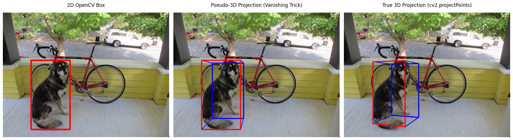

# 3dcv

this repo tracks my journey n projects as i learn n build stuff in 3d computer vision (3dcv).

## my learning approach

### 1. master the mathematical foundation (multi-view geometry)

before even touching a neural net, u gotta understand how the 3d world projects onto a 2d sensor. this is literally just linear algebra n matrix operations.
- **coordinate frames n transformations:** representing 3d rotations n translations using matrices in $SE(3)$.
- **camera models:** understand the pinhole camera model. manual setup of the intrinsic matrix (focal length n optical center) n extrinsic matrix.
- **epipolar geometry:** the core of stereovision! mapping a point in one camera view to a line in another.
- **project idea:** implement a fundamental matrix calculator entirely from scratch using numpy. no opencv for this step - gotta code the svd n matrix multiplications manually!

### 2. understand 3d data representations

unlike 2d images which r always just grids, 3d data requires picking a representation first:
- **point clouds:** unordered sets of (x, y, z) coordinates. usually raw sensor data from lidar.
- **voxels:** 3d pixel grids. super easy cos 3d convolutions work on them, but incredibly memory-intensive.
- **meshes:** vertices n faces defining a surface. great for graphics, mathematically harder for neural nets.
- **implicit representations:** functions (like nerfs) mapping a continuous 3d coordinate straight to density or color.

### 3. the "hello world" of 3d deep learning

once the math n data structures make sense, building the first 3d network is next. pointnet is the perfect starting point.
- **the problem:** standard cnns fail on point clouds cos points r unordered. if u shuffle the rows of the point matrix, standard cnns get confused.
- **the fix:** pointnet uses shared mlps to process each point separately, then uses a symmetric math function - specifically max pooling - to squash all points into a single global feature vector.
- **what i built:** coded a mini pointnet from scratch in pytorch! generated a synthetic dataset of 3d shapes (spheres, cubes, n cylinders) n trained it to classify them.
- **critical points:** the model learns to identify shapes by looking at specific points. in the plot, you can see the red "critical points" that the max pooling step picked out. they outline the actual corners n edges of the cube!

### 4. real-time tooling n hardware processing

since 3d point clouds can have millions of points, real-time performance needs more than just python. we use open3d (which wraps optimized c++ under the hood) to handle massive geometry operations fast.
- **what i built:** a mini real-time lidar processing pipeline!
- **voxel downsampling:** average points in tiny 3d grids (voxels) to drastically cut down point count while keeping the shapes intact.
- **ransac plane segmentation:** mathematically fit a flat plane to the road. once we identify the road, we filter it out to isolate actual obstacles.
- **dbscan clustering:** group the remaining points based on density. if points r close together, they r grouped into the same object (like a car or a pedestrian).
- **hardware compatibility:** added a fallback so the script runs w/ numpy n scikit-learn if the hardware lacks avx/avx2 support, so it never crashes!

### 5. 2d vs 3d object detection

a final showcase comparing traditional 2d cv with 3d cv!
- **2d detection:** using opencv to detect objects with a standard flat 2d bounding box.
- **3d detection:** projecting a 3d bounding box to estimate depth n spatial volume (super critical for robotics n self driving cars).
